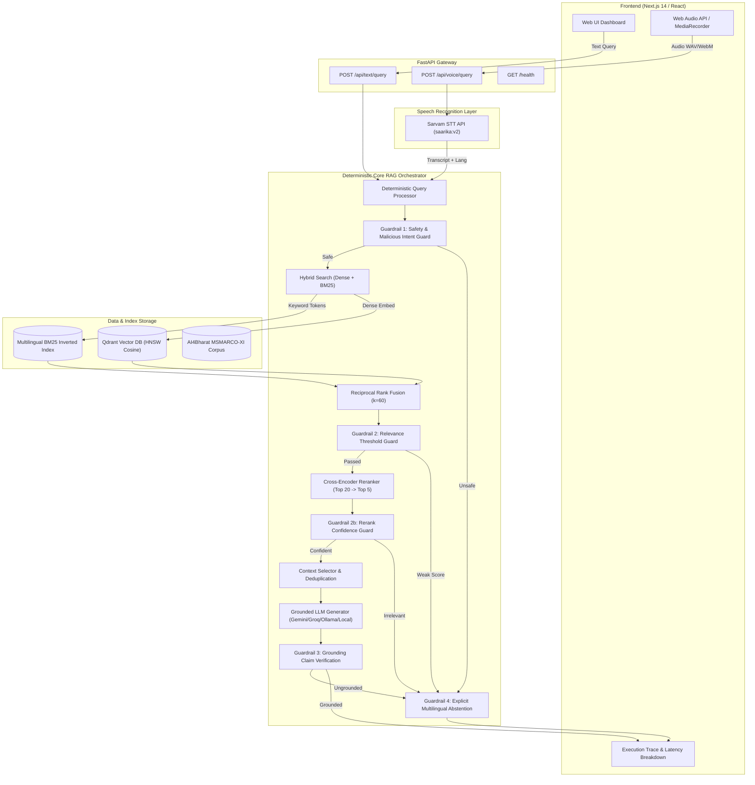
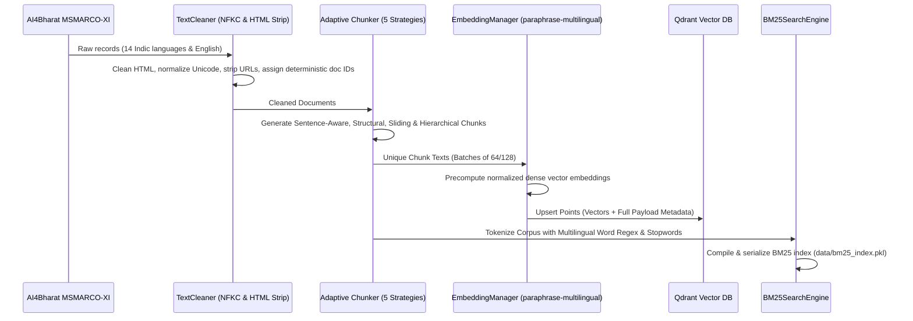
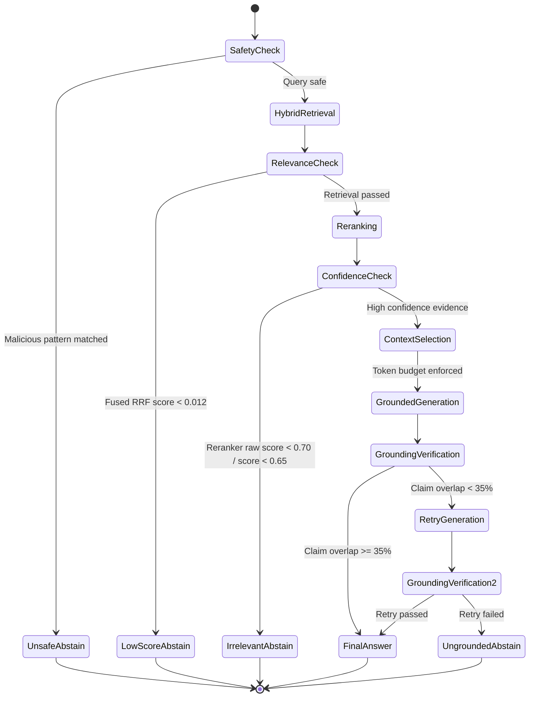

# System Architecture Specification — HH Goa 2026 Voice RAG

## 1. High-Level System Architecture

The Voice-Enabled RAG System is engineered as a **deterministic, modular pipeline** with strict separation of concerns, zero dynamic agentic prompt loops, and high-performance hybrid retrieval.

---

## 2. Ingestion Pipeline Architecture

The ingestion pipeline (`ingestion/run_ingestion.py`) runs offline and precomputes all document representations:

---

## 3. Retrieval & Candidate Fusion Flow

1. **Query Embedding ($O(1)$ warm cache)**:
   - Evaluated using `sentence-transformers/paraphrase-multilingual-MiniLM-L12-v2`.
   - In-memory LRU query cache prevents redundant computation on repeated queries.
2. **Dense Vector Search (Qdrant)**:
   - Approximate Nearest Neighbors (ANN) with Cosine similarity on HNSW graph.
   - Retrieves `dense_top_k = 20` candidates.
3. **Sparse Keyword Search (BM25)**:
   - Multilingual tokenization over 14 Indic scripts + English.
   - Exact term matches, numbers, proper nouns, and technical acronyms.
   - Retrieves `bm25_top_k = 20` candidates.
4. **Reciprocal Rank Fusion (RRF)**:
   $$RRF(d) = \sum_{m \in \{\text{dense}, \text{bm25}\}} \frac{1}{k + \text{rank}_m(d)} \quad (k=60)$$
   - Fuses dense and sparse rankings into a unified list of 20 candidates.
5. **Cross-Encoder Reranking**:
   - `BAAI/bge-reranker-base` evaluates pairwise relevance $(q, d_i)$ to re-score and select the top 5 high-confidence evidence chunks.

---

## 4. Guardrail State Machine & Abstention Logic

The system strictly adheres to deterministic verification before returning any answer:

---

## 5. Latency Engineering Strategies

To achieve sub-200ms RAG operations:
1. **Precomputed Offline Embeddings**: Document embeddings are precalculated during ingestion. Runtime only computes the 1 query vector.
2. **In-Memory Query Embedding Cache**: LRU cache stores query vectors for sub-millisecond query embedding retrieval ($<0.1$ ms).
3. **Local In-Memory BM25**: Pre-compiled inverted index serialized on disk and loaded into RAM on startup (BM25 search latency $<15$ ms).
4. **Model Lifespan Pre-Warming**: FastAPI lifespan loads PyTorch models and BM25 into memory on boot, eliminating first-request cold starts.
5. **High-Precision Monotonic Timing**: All stage durations are measured via `time.perf_counter()`.
