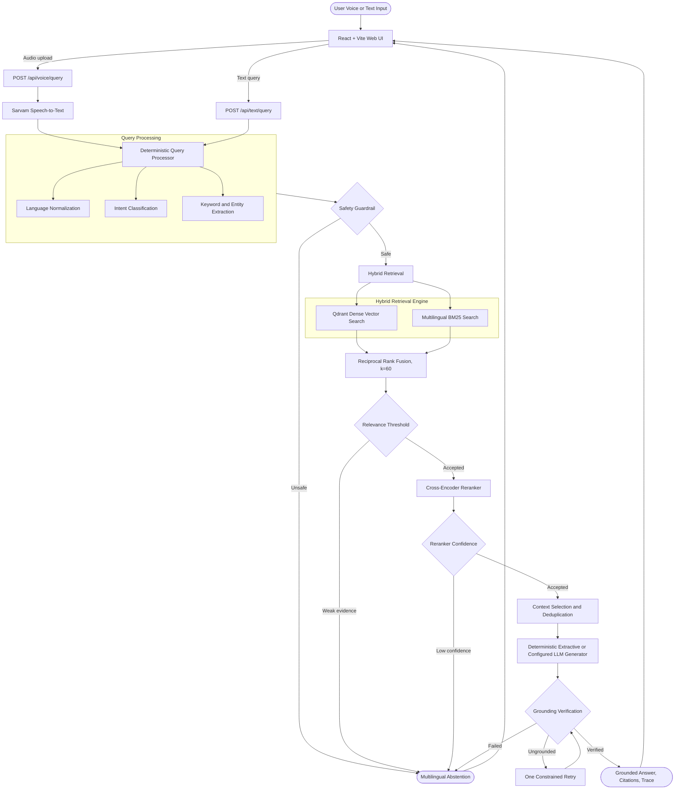

# Voice-Enabled Multilingual RAG

[](https://fastapi.tiangolo.com/)
[](https://vite.dev/)
[](https://qdrant.tech/)
[](https://www.sarvam.ai/)
[](https://huggingface.co/datasets/ai4bharat/MSMARCO-XI)
[](#supported-languages)

A deterministic, low-latency **voice-enabled multilingual Retrieval-Augmented Generation (RAG)** system built for the **HH Goa 2026 Shortlisting Task 2**. The repository combines a FastAPI backend, a React/Vite web application, multilingual dense and sparse retrieval, evidence verification, optional speech services, and detailed execution tracing.

The system accepts text or audio queries, supports **English plus 14 Indian languages**, and processes them through deterministic query normalization, hybrid retrieval (**Qdrant dense search + BM25 keyword search + Reciprocal Rank Fusion**), optional cross-encoder reranking, context selection, grounded answer generation, and explicit abstention when evidence is insufficient. Optional Sarvam services provide speech-to-text and text-to-speech capabilities; the default local generation path does not require a proprietary LLM API key.

---

## 1. System Architecture



The backend pre-warms the embedding model, reranker, BM25 index, and retrieval components during application startup. The frontend runs as a React/Vite client with an Express-based runtime and proxies API requests to the FastAPI service during development.

---

## 2. Key Features

- **Multilingual voice and text queries:** Supports microphone recording through the browser, audio upload to the FastAPI service, optional Sarvam speech-to-text, text queries, and optional Sarvam text-to-speech playback.
- **Supported-language registry:** The backend maintains one canonical registry for language names, scripts, dataset shards, STT/TTS codes, regional codes, and Urdu right-to-left rendering metadata.
- **Hybrid retrieval:** Combines multilingual dense vector search in Qdrant with BM25 exact-term matching, then fuses candidates with Reciprocal Rank Fusion before reranking.
- **Adaptive ingestion and chunking:** Supports structural, sentence-aware, sliding-window, semantic, and multi-resolution chunking strategies through the offline ingestion pipeline.
- **Deterministic guardrails and abstention:** Applies safety filtering, relevance thresholds, reranker confidence checks, grounding verification, and explicit multilingual abstention instead of returning unsupported answers.
- **Evidence-first responses:** Returns citations, retrieved passages, retrieval counts, confidence, grounding status, abstention reasons, and a stage-by-stage execution trace.
- **Latency instrumentation:** Tracks query processing, embedding, dense retrieval, BM25 search, fusion, reranking, context selection, generation, guardrails, and end-to-end timings.
- **React/Vite application:** Provides a responsive interface with voice capture, language selection, evidence cards, pipeline status, latency metrics, theme support, and audio playback.
- **Operational endpoints:** Exposes health, sanitized runtime configuration, supported-language metadata, in-memory metrics, UI translation, and text-to-speech routes in addition to the core query endpoints.

### Supported Languages

The current registry contains **15 languages: English and 14 Indian languages**. The canonical codes below are used by the backend API and frontend language selector.

| Language | Code | Script | Language | Code | Script |
|---|---|---|---|---|---|
| Assamese | `as` | Assamese/Bengali | Bengali | `bn` | Bengali |
| Gujarati | `gu` | Gujarati | Hindi | `hi` | Devanagari |
| Kannada | `kn` | Kannada | Malayalam | `ml` | Malayalam |
| Marathi | `mr` | Devanagari | Nepali | `ne` | Devanagari |
| Odia | `or` | Odia | Punjabi | `pa` | Gurmukhi |
| Sanskrit | `sa` | Devanagari | Tamil | `ta` | Tamil |
| Telugu | `te` | Telugu | Urdu | `ur` | Arabic, RTL |
| English | `en` | Latin | — | — | — |

---

## 3. Retrieval Benchmark Evaluation

The retrieval benchmark uses **75 ground-truth labeled queries** from the MSMARCO-XI validation set. The figures below are retained from the repository evaluation report; see [`EVALUATION.md`](EVALUATION.md) for methodology and additional experiments.

| Strategy | Recall@5 | Recall@10 | Recall@20 | MRR | Precision@5 |
|---|---|---|---|---|---|
| **Dense Only (Qdrant Vector Search)** | 49.33% | 60.00% | 72.00% | 0.2937 | 10.40% |
| **BM25 Only (Keyword Search)** | 56.00% | 68.00% | 72.00% | 0.3394 | 11.73% |
| **Hybrid RRF (Dense + BM25)** | 68.00% | 76.00% | **84.00%** | 0.3544 | 14.40% |
| **Hybrid RRF + Cross-Encoder** | **73.33%** | **73.33%** | 73.33% | **0.4687** | **15.20%** |

The hybrid configuration improves Recall@20 from 72.00% for dense-only retrieval to 84.00% before reranking. The cross-encoder configuration provides the strongest MRR and Precision@5 in this evaluation.

---

## 4. Latency Benchmark Evaluation

The latency benchmark covers **162 multilingual test queries** using monotonic timers. Measurements depend on hardware, model warm-up state, storage configuration, and whether generation is local or provided by an external service.

| Pipeline Component | P50 (Median) | P70 | P90 | P100 (Max) | Mean |
|---|---:|---:|---:|---:|---:|
| **Query Processing** | 0.08 ms | 0.09 ms | 0.12 ms | 0.33 ms | 0.09 ms |
| **Query Embedding (Warm)** | 20.16 ms | 27.86 ms | 37.41 ms | 217.93 ms | 24.82 ms |
| **Dense Vector Search (Qdrant)** | 34.01 ms | 38.89 ms | 54.00 ms | 71.31 ms | 35.66 ms |
| **BM25 Keyword Search** | 16.03 ms | 20.54 ms | 27.69 ms | 38.20 ms | 17.62 ms |
| **RRF Candidate Fusion** | 0.10 ms | 0.11 ms | 0.14 ms | 0.19 ms | 0.10 ms |
| **Context Selection & Deduplication** | 0.05 ms | 0.09 ms | 0.13 ms | 0.17 ms | 0.05 ms |
| **Grounded Generation** | 0.01 ms | 0.02 ms | 0.03 ms | 0.04 ms | 0.01 ms |
| **Guardrails & Verification** | 0.14 ms | 0.25 ms | 0.37 ms | 0.86 ms | 0.15 ms |
| **Total Hybrid RAG Search** | **70.43 ms** | **87.74 ms** | **119.76 ms** | **328.79 ms** | **78.44 ms** |

These are benchmark observations, not service-level guarantees. Run the benchmark scripts on the target machine when comparing deployments.

---

## 5. Local Setup & Quickstart

### Prerequisites

- Python 3.10 or newer
- Node.js 20 or newer
- pnpm 10.x for the frontend package
- Git
- Optional: Docker and Docker Compose for containerized services
- Optional: a Sarvam API key for hosted speech-to-text and text-to-speech

### 1. Clone Repository & Setup Virtual Environment

```bash
git clone https://github.com/Avaneesh27/hh-goa-2026-task-2.git
cd hh-goa-2026-task-2

# Python virtual environment
python -m venv venv

# Windows PowerShell
.\venv\Scripts\Activate.ps1

# Windows Command Prompt
venv\Scripts\activate.bat

# Linux/macOS
source venv/bin/activate

# Install backend and ingestion requirements
python -m pip install --upgrade pip
python -m pip install -r requirements.txt
```

### 2. Environment Configuration

Copy `.env.example` to `.env` and fill in only the services you intend to use. Never commit `.env` or place production credentials in the repository.

```bash
# Linux/macOS
cp .env.example .env

# Windows PowerShell
Copy-Item .env.example .env
```

The main settings are:

```ini
# Generation: local is the default deterministic path
LLM_PROVIDER=local
LLM_API_KEY=
LLM_MODEL=local
LLM_BASE_URL=

# Optional Sarvam speech services
SARVAM_API_KEY=

# Local embedding and reranking models
EMBEDDING_MODEL=sentence-transformers/paraphrase-multilingual-MiniLM-L12-v2
RERANKER_MODEL=BAAI/bge-reranker-base

# Qdrant and BM25 storage
USE_LOCAL_QDRANT_STORAGE=true
LOCAL_QDRANT_PATH=data/qdrant_db
QDRANT_URL=http://localhost:6333
QDRANT_COLLECTION=msmarco_hindi_english
BM25_INDEX_PATH=data/bm25_index.pkl

# Service URLs
BACKEND_HOST=0.0.0.0
BACKEND_PORT=8000
BACKEND_URL=http://localhost:8000
FRONTEND_URL=http://localhost:3000
```

The default local configuration uses the multilingual embedding model `sentence-transformers/paraphrase-multilingual-MiniLM-L12-v2` and the `BAAI/bge-reranker-base` cross-encoder. The first run may download model weights and dataset files, so allow additional disk space and network time.

### 3. Run Offline Dataset Ingestion (One-Time)

Generated indexes, downloaded dataset artifacts, Qdrant storage, and BM25 files are runtime assets under `data/`; they are not intended to be committed to Git.

```bash
# Ingest the default Hindi validation shard
python ingestion/run_ingestion.py 1500

# Ingest a selected number of records for every supported Indian language
python ingestion/ingest_multilingual.py 200 all

# Or ingest selected language codes
python ingestion/ingest_multilingual.py 200 hi,bn,gu,mr,ta,te
```

The ingestion pipeline loads the selected MSMARCO-XI shard, cleans and deduplicates records, creates chunks, computes embeddings, upserts vectors to Qdrant, and compiles the multilingual BM25 index. The scripts support checkpoints and resumable workflows; inspect their command-line help for advanced options.

### 4. Run Automated Test Suite

```bash
python -m pytest tests/ -v
```

The backend test suite covers language normalization, cleaning, chunking, retrieval, guardrails, orchestration, speech-related behavior, and text-to-speech helpers. Frontend checks and tests are available through the frontend package scripts.

### 5. Start Backend Server

```bash
python -m uvicorn backend.main:app --host 0.0.0.0 --port 8000
```

The backend API and Swagger UI will be available at:

- API base URL: `http://localhost:8000`
- Swagger UI: `http://localhost:8000/docs`
- ReDoc: `http://localhost:8000/redoc`

### 6. Start Frontend Web UI

In a separate terminal:

```bash
cd frontend
corepack enable
pnpm install
pnpm dev
```

The React/Vite development server starts at `http://localhost:3000` when that port is available and proxies `/api` and `/health` requests to the backend at `http://localhost:8000`. Useful frontend commands include:

```bash
pnpm check   # TypeScript validation
pnpm test    # Vitest suite
pnpm build   # Vite client build and Express server bundle
pnpm start   # Serve the production bundle
```

---

## 6. Docker Deployment

The repository includes a Docker Compose definition for Qdrant, the FastAPI backend, and the frontend service:

```bash
docker compose up --build
```

The configured service endpoints are:

- Frontend UI: `http://localhost:3000`
- Backend API: `http://localhost:8000`
- Swagger UI: `http://localhost:8000/docs`
- Qdrant dashboard: `http://localhost:6333/dashboard`

The backend container expects the generated `data/` assets to be available and maps the local `data/` directory into the container. Run ingestion first, or provide an equivalent prepared data volume. The current local-development path in Section 5 is the most reliable way to run the React/Vite frontend; review `Dockerfile.frontend` before production use if the container build is changed independently of the frontend package layout.

---

## 7. Repository Structure

```
HHGOARAG2026/
├── backend/
│   ├── main.py                # FastAPI application entrypoint and lifespan warm-up
│   ├── api.py                 # REST routes for queries, metrics, configuration, languages, translation, and TTS
│   ├── config.py              # Environment-backed settings and retrieval constants
│   ├── schemas.py             # Pydantic request and response models
│   ├── stt.py                 # Sarvam speech-to-text integration
│   ├── tts.py                 # Sarvam text-to-speech integration
│   ├── translation.py         # Backend UI translation helper
│   ├── languages.py           # Canonical 15-language registry and code normalization
│   ├── query.py               # Deterministic query processing and intent detection
│   ├── keywords.py            # Multilingual keyword and entity dictionaries
│   ├── embeddings.py          # Multilingual embeddings and query cache
│   ├── retrieval.py           # Qdrant, BM25, and RRF retrieval
│   ├── reranker.py            # Cross-encoder reranking
│   ├── context.py             # Context selection and deduplication
│   ├── generation.py          # Extractive and configured LLM generation
│   ├── guardrails.py          # Safety, relevance, grounding, and abstention checks
│   ├── orchestrator.py        # Master RAG pipeline orchestration
│   └── metrics.py             # Monotonic timing and latency aggregation
│
├── frontend/
│   ├── client/                # React/Vite client application
│   │   ├── src/main.tsx       # Client entrypoint
│   │   ├── src/pages/         # Application pages
│   │   ├── src/components/    # UI and pipeline components
│   │   ├── src/hooks/         # Browser and UI hooks
│   │   └── public/            # Static assets and sequence frames
│   ├── server/                # Express/Vite runtime and server routes
│   ├── shared/                # Shared frontend types and constants
│   ├── drizzle/               # Database schema and relations
│   ├── package.json           # pnpm scripts and dependencies
│   └── vite.config.ts         # Vite, aliases, build, and API proxy configuration
│
├── ingestion/
│   ├── dataset_inspector.py   # Dataset schema and quality inspection
│   ├── cleaner.py             # Unicode normalization and HTML cleaning
│   ├── chunker.py             # Adaptive chunking strategies
│   ├── indexer.py             # Embedding, Qdrant upsert, BM25 compilation, and checkpoints
│   ├── run_ingestion.py       # Single-language ingestion runner
│   ├── ingest_multilingual.py # Sequential multilingual ingestion runner
│   └── ingest_parallel_multilingual.py # Optional parallel ingestion workflow
│
├── benchmarks/
│   ├── benchmark_queries.json # Curated multilingual benchmark queries and labels
│   ├── generate_queries.py    # Benchmark query generation utilities
│   ├── retrieval_benchmark.py # Recall@K, MRR, and precision evaluation
│   ├── latency_benchmark.py   # P50/P70/P90/P100 latency profiling
│   └── multilingual_5000_evaluation.py # Larger multilingual evaluation workflow
│
├── tests/                     # Backend unit and integration tests
├── reports/                   # Generated evaluation reports and metrics
├── data/                      # Local datasets and generated indexes; not committed
├── docker-compose.yml         # Qdrant, backend, and frontend service definitions
├── Dockerfile.backend         # FastAPI backend image
├── Dockerfile.frontend        # Frontend image definition
├── requirements.txt           # Python dependencies
├── .env.example               # Environment-variable template
├── ARCHITECTURE.md            # Detailed architecture notes
├── API.md                     # REST API documentation
├── EVALUATION.md              # Benchmark methodology and results
└── README.md                  # Project documentation
```

---

## 8. License & Acknowledgments

Built for **HH Goa 2026 Shortlisting Task 2**. The project uses the following open-source datasets, services, and frameworks:

- Dataset: [AI4Bharat MSMARCO-XI][5]
- Speech-to-text and text-to-speech: [Sarvam AI][6]
- Vector database: [Qdrant][4]
- Backend framework: [FastAPI][1]
- Frontend framework and build tool: [React][3] and [Vite][2]

The frontend package metadata declares the **MIT** license. Confirm the intended licensing and add a root `LICENSE` file before redistributing the complete repository.

### References

[1]: https://fastapi.tiangolo.com/ "FastAPI Documentation"
[2]: https://vite.dev/ "Vite Documentation"
[3]: https://react.dev/ "React Documentation"
[4]: https://qdrant.tech/ "Qdrant"
[5]: https://huggingface.co/datasets/ai4bharat/MSMARCO-XI "AI4Bharat MSMARCO-XI Dataset"
[6]: https://www.sarvam.ai/ "Sarvam AI"
