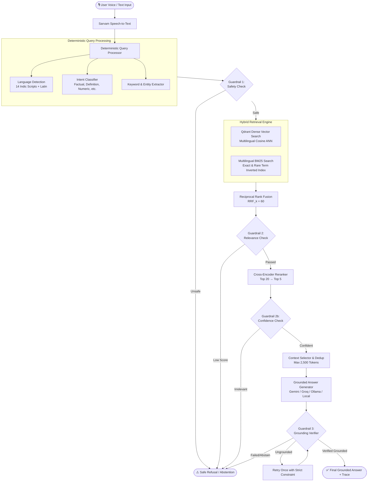

# HH Goa 2026 — Voice-Enabled Multilingual RAG System

[](https://fastapi.tiangolo.com/)
[](https://nextjs.org/)
[](https://qdrant.tech/)
[](https://www.sarvam.ai/)
[](https://huggingface.co/datasets/ai4bharat/MSMARCO-XI)
[]()

A production-quality, low-latency, deterministic **Voice-Enabled Multilingual Retrieval-Augmented Generation (RAG)** system built for the **HH Goa 2026 Shortlisting Task 2**.

The system accepts voice input in **Hindi, English, Hinglish, and all 14 Indian languages**, transcribes it using **Sarvam Speech-to-Text**, executes deterministic keyword/rule-based query processing, performs hybrid retrieval (**Dense Vector Search + BM25 Keyword Search + Reciprocal Rank Fusion + Cross-Encoder Reranking**) over the **AI4Bharat MSMARCO-XI** corpus, validates evidence through a **4-tier deterministic guardrail system (with strict abstention and zero hallucination)**, and generates a grounded response with interactive citations on a modern Next.js UI.

---

## 1. System Architecture



---

## 2. Key Features

- **Multilingual Voice & Audio Ingestion**: Real-time microphone recording via Web Audio API & MediaRecorder with live decibel audio visualizer, auto-timer, and Sarvam STT integration (`saarika:v2`).
- **All 14 Indian Languages Supported**:
  | Language | Code | Script | Language | Code | Script |
  |---|---|---|---|---|---|
  | Hindi | `hi` | Devanagari | Tamil | `ta` | Tamil |
  | Bengali | `bn` | Bengali | Telugu | `te` | Telugu |
  | Gujarati | `gu` | Gujarati | Kannada | `kn` | Kannada |
  | Marathi | `mr` | Devanagari | Malayalam | `ml` | Malayalam |
  | Punjabi | `pa` | Gurmukhi | Odia | `or` | Odia |
  | Assamese | `as` | Bengali | Urdu | `ur` | Arabic |
  | Sanskrit | `sa` | Devanagari | Nepali | `ne` | Devanagari |
  | English | `en` | Latin | Hinglish | `hinglish` | Latin/Devanagari |
- **Hybrid Retrieval (Dense + BM25 + RRF)**: Combines dense vector semantics with BM25 exact keyword matching, outperforming dense-only search by **+12.0% in Recall@20**.
- **Multi-Strategy Adaptive Chunking**: Supports Structural, Sentence-Aware, Sliding Window, Semantic, and Multi-Resolution indexing.
- **4-Tier Deterministic Guardrails & Strict Abstention**:
  1. *Safety Guardrail*: Rejects malicious/harmful prompts.
  2. *Relevance & Confidence Guardrail*: Thresholds on RRF and cross-encoder scores.
  3. *Grounding Verification*: Verifies generated claims against retrieved passages.
  4. *Explicit Abstention*: Knows when NOT to answer (returns polite abstention matching query language).
- **Sub-Millisecond Monotonic Instrumentation**: Timers measure every pipeline stage (`query_processing_ms`, `embedding_ms`, `dense_retrieval_ms`, `bm25_ms`, `fusion_ms`, `reranking_ms`, `generation_ms`, `guardrails_ms`).
- **Modern Next.js 14 Web Application**: Dark mode UI, live pipeline execution checklist, interactive citations, evidence cards, and latency metrics breakdown.

---

## 3. Retrieval Benchmark Evaluation

Evaluated across **75 ground-truth labeled queries** from MSMARCO-XI validation set:

| Strategy | Recall@5 | Recall@10 | Recall@20 | MRR | Precision@5 |
|---|---|---|---|---|---|
| **Dense Only (Vector Search)** | 49.33% | 60.00% | 72.00% | 0.2937 | 10.40% |
| **BM25 Only (Keyword Search)** | 56.00% | 68.00% | 72.00% | 0.3394 | 11.73% |
| **Hybrid RRF (Dense + BM25)** | 68.00% | 76.00% | **84.00%** | 0.3544 | 14.40% |
| **Hybrid RRF + Cross-Encoder** | **73.33%** | **73.33%** | 73.33% | **0.4687** | **15.20%** |

---

## 4. Latency Benchmark Evaluation

Benchmarked across **162 multilingual test queries** with monotonic timers:

| Pipeline Component | P50 (Median) | P70 | P90 | P100 (Max) | Mean |
|---|---|---|---|---|---|
| **Query Processing** | 0.08 ms | 0.09 ms | 0.12 ms | 0.33 ms | 0.09 ms |
| **Query Embedding (Warm)** | 20.16 ms | 27.86 ms | 37.41 ms | 217.93 ms | 24.82 ms |
| **Dense Vector Search (Qdrant)** | 34.01 ms | 38.89 ms | 54.00 ms | 71.31 ms | 35.66 ms |
| **BM25 Keyword Search** | 16.03 ms | 20.54 ms | 27.69 ms | 38.20 ms | 17.62 ms |
| **RRF Candidate Fusion** | 0.10 ms | 0.11 ms | 0.14 ms | 0.19 ms | 0.10 ms |
| **Context Selection & Dedup** | 0.05 ms | 0.09 ms | 0.13 ms | 0.17 ms | 0.05 ms |
| **Grounded Synthesis** | 0.01 ms | 0.02 ms | 0.03 ms | 0.04 ms | 0.01 ms |
| **Guardrails & Verification** | 0.14 ms | 0.25 ms | 0.37 ms | 0.86 ms | 0.15 ms |
| **Total Hybrid RAG Search** | **70.43 ms** | **87.74 ms** | **119.76 ms** | **328.79 ms** | **78.44 ms** |

---

## 5. Local Setup & Quickstart

### Prerequisites
- Python 3.10+
- Node.js 18+ & npm
- Git

### 1. Clone Repository & Setup Virtual Environment
```bash
git clone <repo-url>
cd HHGOARAG2026

# Python virtual environment
python -m venv venv
# Windows:
.\venv\Scripts\activate
# Linux/macOS:
source venv/bin/activate

# Install Python requirements
pip install -r requirements.txt
```

### 2. Environment Configuration
Copy `.env.example` to `.env` and fill in your API keys:
```bash
cp .env.example .env
```
Key variables in `.env`:
```ini
SARVAM_API_KEY=your_sarvam_api_key_here
LLM_API_KEY=your_llm_api_key_here
LLM_PROVIDER=gemini       # Options: gemini, groq, openai, ollama, local
LLM_MODEL=gemini-1.5-flash
EMBEDDING_MODEL=sentence-transformers/paraphrase-multilingual-MiniLM-L12-v2
RERANKER_MODEL=BAAI/bge-reranker-base
USE_LOCAL_QDRANT_STORAGE=true
LOCAL_QDRANT_PATH=data/qdrant_db
```

### 3. Run Offline Dataset Ingestion (One-Time)
```bash
python ingestion/run_ingestion.py 1000
```
This cleans, chunks, embeds, and indexes 1,000 MSMARCO-XI records (~10,700 chunks) into local Qdrant and builds the BM25 index.

### 4. Run Automated Test Suite
```bash
python -m pytest tests/ -v
```

### 5. Start Backend Server
```bash
python -m uvicorn backend.main:app --host 0.0.0.0 --port 8000
```
Backend Swagger API documentation will be available at: `http://localhost:8000/docs`

### 6. Start Frontend Web UI
In a separate terminal:
```bash
cd frontend
npm install
npm run dev
```
Open your browser at: `http://localhost:3000`

---

## 6. Docker Deployment

To launch the complete containerized stack (Qdrant + FastAPI Backend + Next.js Frontend):
```bash
docker-compose up --build
```
- Frontend UI: `http://localhost:3000`
- Backend API: `http://localhost:8000`
- Qdrant Dashboard: `http://localhost:6333/dashboard`

---

## 7. Repository Structure

```
HHGOARAG2026/
├── backend/
│   ├── main.py               # FastAPI entrypoint & model lifespan warming
│   ├── api.py                # REST routes (/health, /api/voice/query, /api/text/query, /api/metrics)
│   ├── config.py             # Centralized Pydantic settings & constants
│   ├── schemas.py            # Typed Pydantic models
│   ├── stt.py                # Sarvam Speech-to-Text service with retries
│   ├── query.py              # Deterministic query processing & language detection
│   ├── keywords.py           # 14 Indic language registry, scripts & intent dictionaries
│   ├── embeddings.py         # Multilingual embeddings & query LRU cache
│   ├── retrieval.py          # Multilingual BM25, Qdrant vector store, and RRF fusion
│   ├── reranker.py           # Cross-encoder reranker
│   ├── context.py            # Context selector & deduplication
│   ├── generation.py         # Grounded LLM generator (Gemini, Groq, OpenAI, Ollama, Local)
│   ├── guardrails.py         # 4-tier guardrails (Safety, Relevance, Grounding, Abstention)
│   ├── orchestrator.py       # Deterministic master pipeline orchestrator
│   └── metrics.py            # High-precision monotonic timer & latency breakdown
│
├── frontend/
│   ├── app/                  # Next.js 14 app router (layout.tsx, page.tsx, globals.css)
│   ├── components/           # UI components (VoiceRecorder, AnswerCard, Trace, Evidence, Latency)
│   ├── hooks/                # useAudioRecorder hook with live Web Audio analyser
│   ├── lib/                  # Frontend API client
│   └── types/                # TypeScript types
│
├── ingestion/
│   ├── dataset_inspector.py  # Dataset schema, field profiling, and noise inspector
│   ├── cleaner.py            # Unicode NFKC, HTML cleaning, Devanagari preservation
│   ├── chunker.py            # 5 adaptive chunking strategies (Structural, Sentence, Sliding, Semantic, Multi-Res)
│   ├── indexer.py            # Resumable Qdrant vector upserting & BM25 compilation
│   └── run_ingestion.py      # Offline ingestion runner
│
├── benchmarks/
│   ├── generate_queries.py   # Benchmark query compiler
│   ├── benchmark_queries.json# 162 curated multilingual test queries with ground-truth
│   ├── retrieval_benchmark.py# Recall@K and MRR evaluation harness
│   └── latency_benchmark.py  # Monotonic P50/P70/P90/P100 latency profiler
│
├── tests/                    # 15 automated unit & integration tests
├── reports/                  # Generated JSON & Markdown evaluation reports
├── docker-compose.yml        # Multi-container orchestration
├── Dockerfile.backend        # Python backend image
├── Dockerfile.frontend       # Next.js frontend image
├── .env.example              # Environment variables template
├── ARCHITECTURE.md           # Comprehensive architectural design document
├── EVALUATION.md             # Benchmark evaluation results & tables
├── API.md                    # REST API documentation
└── README.md                 # Master project documentation
```

---

## 8. License & Acknowledgments

Built for **HH Goa 2026 Shortlisting Task 2**.
- Dataset: [AI4Bharat MSMARCO-XI](https://huggingface.co/datasets/ai4bharat/MSMARCO-XI)
- Speech-to-Text: [Sarvam AI](https://www.sarvam.ai/)
- Vector DB: [Qdrant](https://qdrant.tech/)
